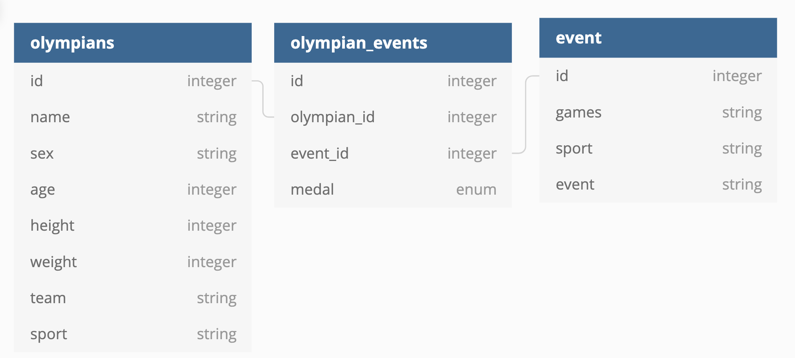

# Mount Olympus API

Created by: [Vincent Provenzano](https://github.com/Vjp888)

##Introduction

This is a RESTfull API built in Ruby on Rails. This is the final project of the 4th module at Turing School of Software & Design, back-end program.

The goal of this project was to simulate a Take home challege from a prospective employer by creating an application that would be able to do basic aggregation of data gather from the 2016 olympic games.

My Goal for this project is to showcase my ability to create clear documentation of process with verbose commits (Using a rebase and squashing workflow), Pull Request Templates and use of GitHub Projects Boards.

##Setup

Ensure that you have Ruby 2.4.1 and Ruby on Rails 5.2.3 installed on your computer.

Once installed fork or clone this repository to your local machine and run

``` bundle install ```

Once that is complete run:
``` rails db:{drop,create,migrate,seed}```

followed by:

```rails s```

The app is set to use ```localhost:3000``` and you are ready to use the endpoints below.

##Quick Start-up

A good starting point to view the application will be ```GET localhost:3000/api/v1/olympians```


##Endpoints

###Olympians

Olympians has the basic functionality of being able to request all available olympians or to send a query of ```age``` with the parameters of ```oldest``` or ```youngest```.

####Request:

```GET /api/v1/olympians```

####Response:
Status: 200

```
{
  "olympians":
    [
      {
        "name": "Maha Abdalsalam",
        "team": "Egypt",
        "age": 18,
        "sport": "Diving"
        "total_medals_won": 0
      },
      {
        "name": "Ahmad Abughaush",
        "team": "Jordan",
        "age": 20,
        "sport": "Taekwondo"
        "total_medals_won": 1
      },
      {...}
    ]
}
```
### Query Parameters for olympians
If you desire to receive the ```oldest``` or ```youngest``` olympian your request will be as follows:

####Request:
```GET /api/v1/olympians?age=oldest```

####Response:
status: 200

```
{
  [
    {
      "name": "Julie Brougham",
      "team": "New Zealand",
      "age": 62,
      "sport": "Equestrianism"
      "total_medals_won": 0
    }
  ]
}
```

Should you send a bad query parameter or if there are no olympians in database the error will be:

Status: 404

``` { error: 'No Olympians, Please Seed Database' } ```

### Statistics for Olympians
A specific endpoint will return basic statistics for all olympians in the database.

####Request:
```GET /api/v1/olympian_stats```

####Response:

status: 200

```
{
    "olympian_stats": {
      "total_competing_olympians": 3120
      "average_weight:" {
        "unit": "kg",
        "male_olympians": 75.4,
        "female_olympians": 70.2
      }
      "average_age:" 26.2
    }
}
```

if the database in not seeded with olympians you will revieve an error:

Status: 404

```{ error: 'No Olympians' } ```

###Events
To receive a listing of all events sorted by sport in the system your request will be as follows:

####Request
```GET /api/v1/events```

####Response
Please note that all events will be listed by their sport for organization purposes.

Status: 200

```
{
  "events":
    [
      {
        "sport": "Archery",
        "events": [
          "Archery Men's Individual",
          "Archery Men's Team",
          "Archery Women's Individual",
          "Archery Women's Team"
        ]
      },
      {
        "sport": "Badminton",
        "events": [
          "Badminton Men's Doubles",
          "Badminton Men's Singles",
          "Badminton Women's Doubles",
          "Badminton Women's Singles",
          "Badminton Mixed Doubles"
        ]
      },
      {...}
    ]
}
```

If no events are seeded within the system you will recieve the error:

Status: 404

```{ error: 'No events in system' } ```

###Events with Medalists
This endpoint will return a specific event alongside all their medalists for this specific event.

####Request:
```GET /api/v1/events/:event_id/medalists```

####Response:

Status: 200

```
{
  "event": "Badminton Mixed Doubles",
  "medalists": [
      {
        "name": "Tontowi Ahmad",
        "team": "Indonesia-1",
        "age": 29,
        "medal": "Gold"
      },
      {
        "name": "Chan Peng Soon",
        "team": "Malaysia",
        "age": 28,
        "medal": "Silver"
      }
    ]
}
```

If an invalid event id is sent you will receive:

status: 404

```{ error: 'No event found'} ```

###Database Schema



###Tech Stack

- Ruby on Rails 5.2.3
- Travis CI
- Rspec
